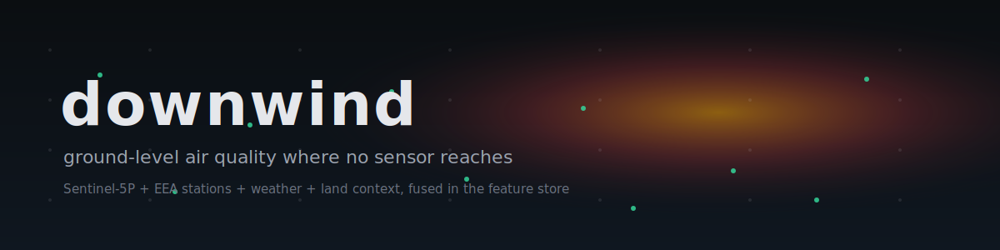
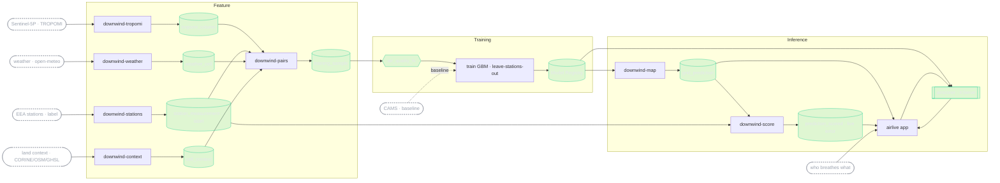

# downwind



[](https://github.com/MagicLex/awesome-ml-systems)
[](https://www.hopsworks.ai/)

What is in the air where nobody is measuring? A spatial system that estimates ground-level
air pollution (PM2.5, NO2) across Europe at the places the ground-station network does not
reach. A satellite sees a coarse column from space, a few thousand ground stations give
sparse truth, weather and land context decide what actually reaches the air people breathe.
The model learns the map between them at the stations, then fills the gaps between the dots,
and reports a calibrated estimate with an uncertainty band, never a measurement.

The honest metric is the **error reduction over spatial interpolation at held-out
stations**: the model is only allowed to prove itself at stations it never trained on, so
the number reflects real gap-filling, not memorising a sensor location.

## The idea

Air quality is measured at points. Regulation, health studies and public dashboards then
interpolate between those points, which smears over motorways, valleys, industrial plumes
and everywhere a station is not. Satellite column data covers everywhere but sits kilometres
up and averages over coarse cells. `downwind` fuses the two with the meteorology and land
context that connect a column to a ground concentration, validated against the stations,
then predicts the field everywhere. The reveal is the attention rail: the worst
**unmonitored** hotspots, high predicted pollution far from any sensor, which is where the
next monitor should go.

The estimate is for screening, exposure awareness and sensor-siting. It is not a regulatory
measurement, every point carries its uncertainty, out-of-domain reads unknown, and every
point links back to the raw source-of-truth services.

## Architecture

An FTI (feature, training, inference) system on Hopsworks. Every source arrives on its own
clock and cadence and they are fused point-in-time, with no leakage and no train/serve skew.
Serving fuses the cell's **precomputed** static context with the **on-demand** satellite and
weather for the queried point and time. That fusion is the showpiece.



The sources, each on a different cadence:

| source | cadence | role |
|---|---|---|
| Sentinel-5P TROPOMI | daily, ~5.5 km | NO2 column and aerosol index from space, the coarse signal |
| EEA ground stations | hourly | the sparse ground-truth label, by station |
| open-meteo / ERA5 | hourly | wind, boundary layer, precipitation, the column-to-ground modulator |
| CORINE / OSM / GHSL / DEM | static | land cover, road density, population, elevation, point sources |
| Copernicus CAMS | ~hourly, ~10 km | modelled ground concentration, a feature and a baseline to refine |

The file-by-file map:

```
downwind_features.py              shared, skew-free: (lat,lon,time) -> feature vector
pipelines/tropomi_pipeline.py     F1  Sentinel-5P columns -> tropomi_column        (Hopsworks job)
pipelines/stations_pipeline.py    F2  EEA/OpenAQ readings -> station_measurement   (Hopsworks job)
pipelines/weather_pipeline.py     F3  open-meteo -> weather_cell                   (Hopsworks job)
pipelines/context_pipeline.py     F4  CORINE/OSM/GHSL -> cell_context              (Hopsworks job)
pipelines/pairs_pipeline.py       F5  station x hour samples -> training_sample    (Hopsworks job)
pipelines/train.py                T   feature view -> air_quality_* -> registry    (Hopsworks job)
pipelines/map_pipeline.py         I1  grid prediction -> grid_prediction           (Hopsworks job)
pipelines/score_pipeline.py       M   held-out station scoring -> prediction_scored(Hopsworks job)
serving/                          I2  airscorer predictor + KServe deploy
app/                              A   airlive earth-observation app
tools/                            schedule.py, build_envs.py
reqs/downwind.md                  the FTI specification
```

## Reproduce

Clone into a Hopsworks project on the `/hopsfs/...` FUSE mount. Paths self-derive, nothing
is hardcoded to a username. Keys live in Hopsworks secrets, never in the repo.

```bash
make envs            # clone the collector / serve envs + pin deps
make tropomi-job     # Sentinel-5P columns
make stations-job    # EEA station labels
make weather-job     # open-meteo weather
make context-job     # static land context (one-time)
make pairs-job       # station x hour training samples
make train-job       # air_quality_pm25 / air_quality_no2
make map-job         # continuous grid prediction
make serve           # airscorer KServe endpoint
make score-job       # live held-out station scoring
make app             # airlive earth-observation app
```

## The demo

`airlive`: a continuous European pollution map, denser than the sensor net. The ground
stations sit on top as truth dots, the model fills everything between them. Click anywhere
for a local estimate, its uncertainty, the plain-word reasons behind it (downwind of a
motorway, a trapping boundary layer, a high satellite column) and the nearest real station
to cross-check against. The attention rail ranks the worst unmonitored hotspots, where a
monitor is missing. Hide the stations and the map still shows the plume, reveal them and
they agree. Every point links out to the EEA portal and Copernicus, because the system
estimates for screening, it does not measure.
