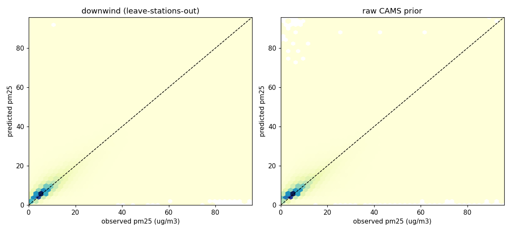
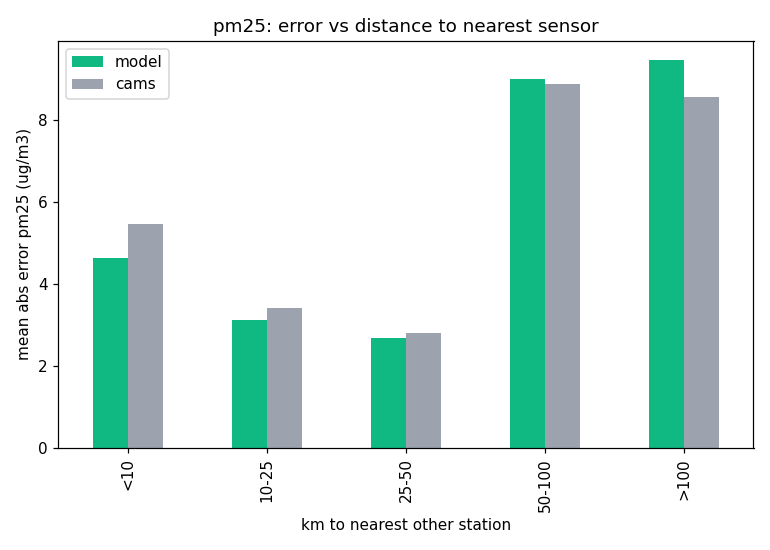
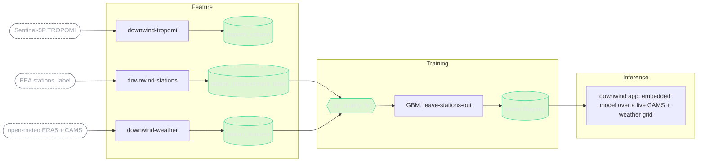

# downwind


[](https://github.com/MagicLex/awesome-ml-systems)
[](https://www.hopsworks.ai/)

What is in the air where nobody is measuring? A spatial system that estimates ground-level
air pollution (PM2.5, NO2) across Europe at the places the ground-station network does not
reach. A satellite sees a coarse column from space, a few thousand ground stations give
sparse truth, weather and land context decide what actually reaches the air people breathe.
The model learns the map between them at the stations, then fills the gaps between the dots.

The honest metric is the **error reduction over the raw CAMS prior at held-out stations**:
the model is only allowed to prove itself at stations it never trained on, so the number
reflects real gap-filling, not memorising a sensor location.


The field is a hex mosaic that encodes trust, not just concentration: warm hexes are pure
model prediction, violet hexes sit within 25 km of a reporting sensor, and opacity falls
with distance from any sensor, so a faint cell reads as "low trust". White dots are the
measured stations. The click card interrogates any point: the model estimate, the CAMS
prior it adjusted, and the nearest real sensor.

## Results (v1)

In plain words: without this system, the best available estimate at an unmonitored point
is the raw CAMS forecast. For PM2.5 the model's estimate is **20.9% closer to what a real
station would have measured** (RMSE 14.76 down to 11.67 ug/m3), scored only at stations it
never trained on.

| model | held-out RMSE | CAMS prior RMSE | error reduction | r2 model / CAMS |
|---|---|---|---|---|
| air_quality_pm25 v1 | 11.67 ug/m3 | 14.76 ug/m3 | **20.9%** | 0.61 / 0.38 |
| air_quality_no2 | retraining | | | |



Left: the model at held-out stations. Right: the raw CAMS prior at the same points. The
model hugs the diagonal tighter and kills the CAMS over-prediction cloud in the top-left.



Error by distance to the nearest other station: the model wins where stations are within
50 km and roughly ties CAMS beyond that, where no neighbouring signal exists to learn from.
That far-field gap is what the staged land-context features (v1.5) are for.

Leave-stations-out GroupKFold over 80 stations, 3.3M station-hours, 5 countries
(AL/BA/BE/LU/MT). A fifth of the remaining CAMS error at places the model has never seen
is the whole point: that margin is what a new monitor would have measured. The first NO2
run surfaced physically impossible label outliers (station-hours in the thousands of
ug/m3) that drowned RMSE for model and baseline alike; it was withdrawn and the pipeline
now applies physical label bounds before training. Per-model detail in
[models/](models/).

## The idea

Air quality is measured at points. Regulation, health studies and public dashboards then
interpolate between those points, which smears over motorways, valleys, industrial plumes
and everywhere a station is not. Satellite column data covers everywhere but sits kilometres
up and averages over coarse cells. `downwind` fuses the station truth with the CAMS
modelled prior, the meteorology that connects a column to a ground concentration, and the
station context, validates at held-out stations, then predicts the field everywhere. The
reveal is the attention rail: the worst **unmonitored** hotspots, high predicted pollution
far from any sensor, which is where the next monitor should go.

The estimate is for screening, exposure awareness and sensor-siting. It is not a regulatory
measurement, and every point links back to the raw source-of-truth services.

## Architecture

An FTI (feature, training, inference) system on Hopsworks. Every source arrives on its own
clock and cadence and they are fused point-in-time, with no leakage and no train/serve skew.



The sources, each on a different cadence:

| source | cadence | role |
|---|---|---|
| EEA ground stations | hourly, validated | the sparse ground-truth label, by station |
| open-meteo ERA5 | hourly | wind, temperature, humidity, precipitation, pressure: the column-to-ground modulator |
| Copernicus CAMS | hourly, ~10 km | modelled ground concentration: the prior the model refines and the baseline it must beat |
| Sentinel-5P TROPOMI | daily, ~5.5 km | raw NO2 column + aerosol index from space; collected, staged for the v1.5 feature view (CAMS already assimilates it, v1.5 carries it raw) |

The file-by-file map:

```
downwind_features.py              shared, skew-free: (lat,lon,time) -> feature vector
collect/eea.py                    EEA download API + AQViewer metadata client
collect/openmeteo.py              ERA5 + CAMS archive client (grid-cell fetch, rate-aware)
collect/s5p.py                    CDSE OData search + S3 granule download + pixel sampling
pipelines/stations_pipeline.py    F2  EEA readings -> station_measurement       (Hopsworks job)
pipelines/weather_pipeline.py     F3  open-meteo -> station_features            (Hopsworks job)
pipelines/tropomi_pipeline.py     F1  Sentinel-5P columns -> tropomi_column     (Hopsworks job)
pipelines/train.py                T   feature view -> air_quality_* -> registry (Hopsworks job)
app/                              I   FastAPI + canvas app, embedded model
models/                           model cards
reqs/downwind.md                  the FTI specification
```

Weather and CAMS history are fetched per 0.25-degree grid cell and fanned out to the
stations inside the cell: the underlying models carry no sub-cell information anyway, and
it cuts the API call count ~7x, which is the difference between fitting in a rate limit
and not.

## Reproduce

Clone into a Hopsworks project on the `/hopsfs/...` FUSE mount. Paths self-derive, nothing
is hardcoded to a username. Keys live in Hopsworks secrets, never in the repo:
`CDSE_S3_ACCESS_KEY` / `CDSE_S3_SECRET_KEY` (free Copernicus Data Space account, for
Sentinel-5P) and optionally `OPENMETEO_API_KEY` (commercial; the keyless free tier works,
slower).

```bash
make stations-job    # EEA station labels
make weather-job     # ERA5 weather + CAMS prior per station
make tropomi-job     # Sentinel-5P columns (needs the CDSE keys)
make train-job       # air_quality_pm25 / air_quality_no2 -> registry
make app             # the map app
```

Staged next (v1.5+): the raw TROPOMI column joined into the feature view, static land
context (CORINE/OSM/GHSL), a KServe endpoint, and live held-out self-scoring.

## The demo

A continuous European pollution map, denser than the sensor net. The predicted field and
the measured stations carry separate color ramps (both read the same way, darker is worse),
a dashed frontier marks where predictions are sensor-anchored versus pure gap-filling, and
a 24-hour player animates the field around now. Click anywhere for a local estimate, the
CAMS prior it refined, the plain-word reasons, and the nearest real station to cross-check
against. The attention rail ranks the worst unmonitored hotspots, where a monitor is
missing. Every point links out to the EEA portal and Copernicus, because the system
estimates for screening, it does not measure.
