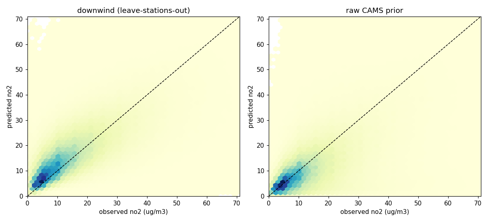
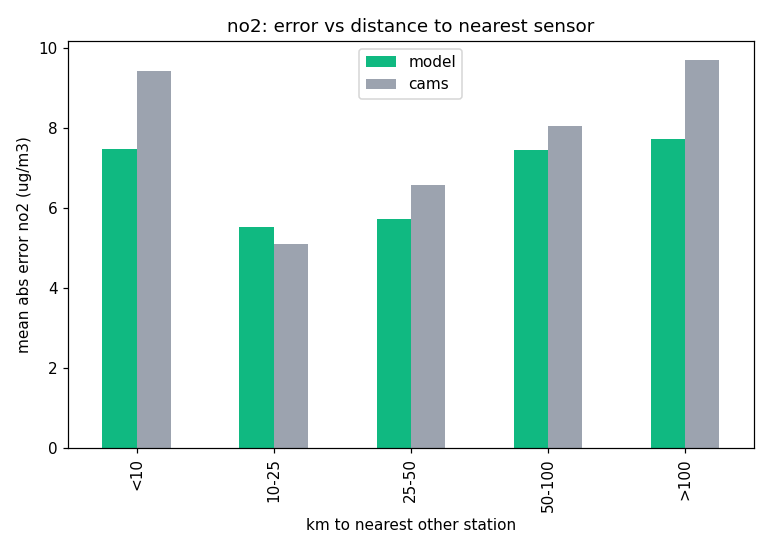

# air_quality_no2

Ground-level NO2 gap-filler, same architecture and validation as
[air_quality_pm25](air_quality_pm25.md).

## First run (2026-07-09) -- withdrawn, never versioned

The first run trained on 4.4M station-hours across 110 stations and produced a held-out
RMSE of 1313 ug/m3 against a CAMS-prior RMSE of 1199 ug/m3, both physically absurd (ambient
NO2 tops out around 200). A handful of stations carry validated-flagged readings in the
thousands of ug/m3; squared error let them dominate model and baseline alike, and both r2
went negative. The model was worse than the prior it was meant to refine, so v1 was deleted
from the registry rather than served.

**Root cause: label hygiene, not architecture.** The pipeline now applies physical label
bounds before training (NO2 kept in (0, 500) ug/m3, PM2.5 in (0, 800)).

## v1 (2026-07-09)

Retrained on bounded labels (NO2 kept in (0, 500) ug/m3) over the rebuilt station set.

| | |
|---|---|
| registry | `air_quality_no2` v1, Hopsworks model registry |
| training data | 6.2M station-hours, 149 stations, 5 countries (AL/BA/BE/LU/MT), 2019 to 2026-07, through `air_quality_fv` v1 |
| validation | leave-stations-out GroupKFold (5 folds, grouped by station) |

### Evaluation

| metric | model | raw CAMS prior |
|---|---|---|
| RMSE | **10.67 ug/m3** | 13.84 ug/m3 |
| MAE | **7.16 ug/m3** | 8.72 ug/m3 |
| r2 | **0.52** | 0.19 |

**22.9% RMSE reduction over the CAMS prior at held-out stations.** CAMS carries far less
skill for NO2 than for PM2.5 (r2 0.19: NO2 is local, traffic-driven, and a 10 km cell
smears it), which is exactly why the learned refinement buys more here.

The model beats CAMS in every distance band except a slight loss at 10-25 km, including
the >100 km deep far field (7.7 vs 9.7 ug/m3 MAE). Same architecture, intended use and
limits as [air_quality_pm25](air_quality_pm25.md).
